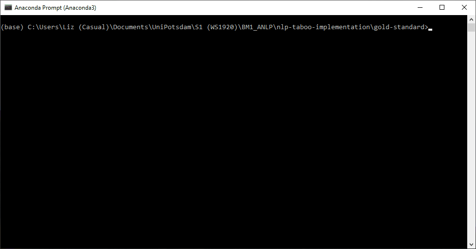

# Taboo Implementation

A Taboo-style card generator, using pre-trained word2vec embeddings and semantic relations from WordNet, and a Taboo player text generator, implemented with an RNN using GRUs.

Final project for the course BM1 Advanced Natural Language Processing at the Universität Potsdam in the winter semester 2019/2020.

Developed by Anna-Janina Goecke, Rodrigo Lopez Portillo Alcocer, and Elizabeth Pankratz.


## What it does

Given a "main word" (the word that your team members should guess), the card generator generates five "taboo words" (the words you cannot use in your description of the main word).



Given a main word and five taboo words, the text generator's goal is to produce syntactically coherent text that describes the main word without using any of the taboo words.


## How to use

To run this project, you need Python 3 and the libraries `gensim`, `math`, `matplotlib`, `nltk`, `numpy`, `os`, `pandas`, `pickle`, `random`, `string`, `torch`, and `time`.
Also, you should download the pre-trained word2vec embeddings, `GoogleNews-vectors-negative300.bin`, from the [link](https://drive.google.com/uc?id=0B7XkCwpI5KDYNlNUTTlSS21pQmM) provided in the course.
(This file is not included in the current repository because of its size.)

Begin by cloning this repository.

```
git clone https://github.com/epankratz/nlp-taboo-implementation
```

### Card generator

Move `GoogleNews-vectors-negative300.bin` into the directory `card-generator/`.

Now, within `card-generator/`, run the following in Python's interactive shell on your command line. (The first call of `draw_card()` will take a couple minutes while the word embeddings are being set up, so go get a coffee and come back ready to play!)

```
# Import the necessary libraries/modules
>>> import gensim; import cardgen as cg

# Load the pre-trained embeddings
>>> model = gensim.models.KeyedVectors.load_word2vec_format('GoogleNews-vectors-negative300.bin', binary=True)

# Draw a card for your favourite word!
>>> cg.draw_card('delight', model)
```

For more detail about how our card generator works, please see `card-generator/walkthrough.ipynb`.


### Text generator

Move or copy `GoogleNews-vectors-negative300.bin` into the directory `text-generation/`.

Within `text-generation/`, open `Demo.ipynb`.
Run the code sequentially without skipping any cells. 
Some instructions might be different depending on the model being tested.

For more detail on how our description generator works, please see `text-generation/Walkthrough.ipynb`.


## Sources

Our text generator implementation was inspired by the following tutorials and blog posts:
- [The Unreasonable Effectiveness of Recurrent Neural Networks](https://karpathy.github.io/2015/05/21/rnn-effectiveness/) by Andrej Karpathy
- [Beginners Guide to Text Generation (Pytorch)](https://www.kaggle.com/ab971631/beginners-guide-to-text-generation-pytorch) by Abhishek Kumar
- [Text Generation with Pytorch](https://machinetalk.org/2019/02/08/text-generation-with-pytorch/) by Trung Tran
